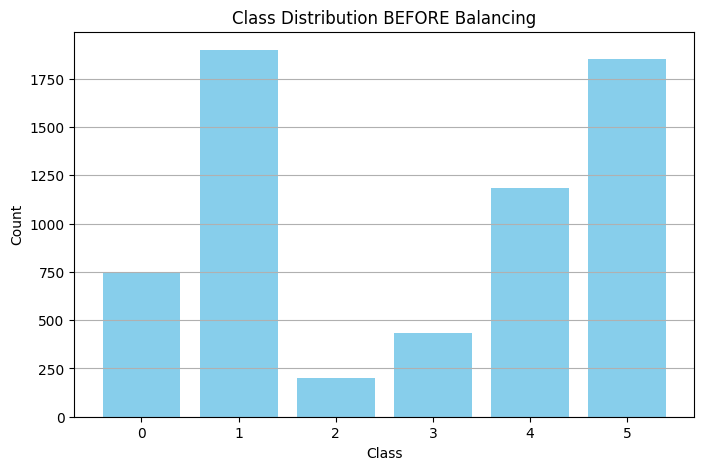
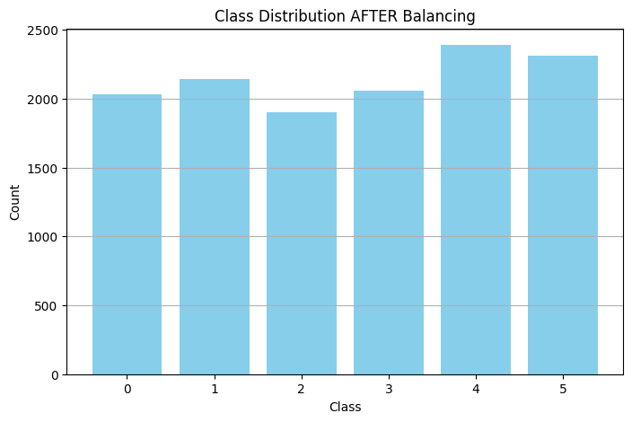
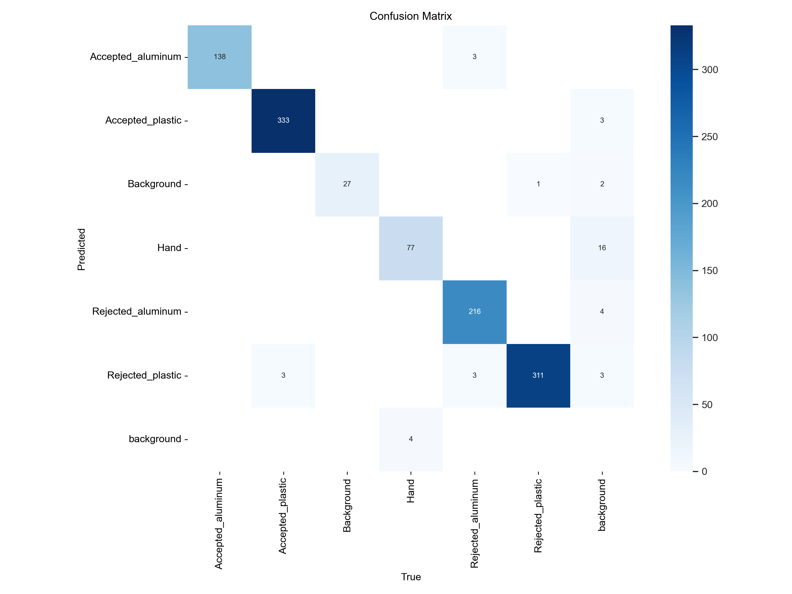
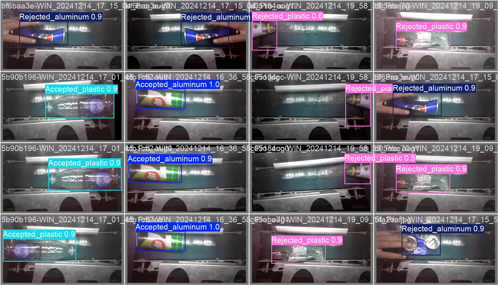

# ♻️ Drop Me - Recyclable Material Detection

This project aims to train an object detection model capable of identifying recyclable materials inside a smart **Recycle Vending Machine** developed by **Drop Me**. The model is trained using a **custom YOLOv8 object detection pipeline** built on top of **Lightning AI** – a powerful platform that enables efficient, scalable, and reproducible AI development.
* The entire training pipeline, preprocessing, and model experiments are managed through [**Lightning AI (lightning.ai)**](https://lightning.ai/), which ensures:

  * Seamless hardware acceleration (multi-GPU, TPU, etc.)
  * Reproducibility and experiment versioning
  * Cleaner model and data separation for modularity and scalability

The data used is custom-collected from inside the vending machine and categorized into six key classes.


## 📁 Project Structure

```
DropMe-Recycle-Detection/
│
├── data/
│   ├── yolo-extracted/          # Dataset unbalanced, processed dataset
│   ├── yolo-extracted-balanced/ # Final balanced, processed dataset
│   └── yolo-new-dataset.zip     # Data compressed 
├── runs/                        # YOLO training results and models
├── data_handling.ipynb          # Data processing and preprocessing
├── yolo8_model_training.ipynb   # YOLOv8 model configuration and training
└── README.md                    # Project overview and instructions
```

---

## 📦 Dataset Information

### 🔢 Classes (6 total)

The project includes the following six classes:

1. `accepted_aluminium`
2. `accepted_plastic`
3. `background`
4. `hand`
5. `rejected_aluminium`
6. `rejected_plastic`

### 🧾 YOLO Format

Each `.txt` label file contains lines in the format:

```
class_id center_x center_y width height
```

* All values are **normalized (0–1)** relative to the image size.
* Labels match images by filename (e.g., `img001.png` → `img001.txt`).

---

## 📊 Data Handling & Preprocessing (data\_handling.ipynb)

The preprocessing pipeline ensures clean, high-quality training data for the model. It includes:

### 1. 🔓 Unzipping

Initial dataset is extracted from the original archive.

### 2. 🧪 Train/Test/Validation Split

The dataset is split into:

* **70% Training**
* **20% Validation**
* **10% Testing**

Each phase gets separate subfolders for `images/` and `labels/`.

### 3. 🧼 Cleaning

* Verifies label/image correspondence.
* Removes mislabeled or empty files.
* Ensures all YOLO labels are correctly formatted.

### 4. 🎨 Data Augmentation

Used to improve model generalization. Includes:

* **Rotation**
* **Flipping**
* **Color Jitter**
* **Random Crop**

✅ **Note**: All label coordinates are correctly **transformed** alongside image augmentations (e.g., after rotation), preserving YOLO format integrity.

### 5. ⚖️ Class Balancing

Some classes (e.g., `accepted_plastic`, `rejected_plastic`) may dominate the dataset.



To resolve this:

* **Undersampling**: Limits number of samples for overrepresented classes.
* **Oversampling**: Augments underrepresented classes to match distribution.

This is the final dataset after balancing:



Final dataset is saved to:

```
yolo-extracted-balanced/
```
---

## ⚙️ YOLOv8 Model Training (yolo8\_model\_training.ipynb)

### 🧠 Model Setup

* Model used: **YOLOv8 (Ultralytics)**
* Framework: `ultralytics` Python package
* Data: `data/yolo-extracted-balanced/data.yaml`

### 🔧 Training Configuration

```python
results = model.train(
    data='data/yolo-extracted-balanced/data.yaml',
    epochs=200,
    imgsz=768,
    batch=16,
    cache=True,
    workers=8,
    amp=True,
    device=device,  # e.g. 'cuda' or 'cpu'
    lr0=0.005,
    lrf=0.0005,
    warmup_epochs=5,
    warmup_momentum=0.75,
    optimizer='AdamW',
    weight_decay=0.0005,
    val=True,
    save_period=5,
    patience=15,
    cos_lr=True
)
```

### 💾 Custom Save Name for the Model

To change the model name (e.g., `dropme-recycle-v1.pt`), you can **manually rename** the saved model inside the `runs/detect/train/weights` directory **after training**.

Alternatively, move it programmatically:

```python
import shutil
shutil.copy('runs/detect/train/weights/best.pt', 'models/dropme-recycle-v1.pt')
```

---

## 📈 Outputs

* Model weights: `runs/detect/train/weights/best.pt`
* Training logs, metrics, loss curves: `runs/detect/train/`
* Validation predictions and visualizations: Automatically saved every few epochs.

---

## 📈 AI Models & Comparisons

### 🧪 Models Evaluated

To ensure the most accurate and efficient recyclable material detection system, multiple AI models were experimented with and benchmarked:

| Model Variant          | Framework   | Purpose                                | Notes                            |
| ---------------------- | ----------- | -------------------------------------- | -------------------------------- |
| **YOLOv8m-unbalanced** | Ultralytics | Waste Classification and detection     | performed well on training but seemed to overfit towards the rejected_plastic when faced with unknown object during testing |
|⚡**YOLOv8m-balanced**  | Ultralytics | Waste Classification and detection     | Same model as **YOLOv8m-unbalanced** but the model was very balanced     |
| **YOLOv12m-unbalanced**| Ultralytics | Waste Classification and detection     | showed same results as **YOLOv8m-unbalance** |
| **YOLOv12m-balanced**  | Torchvision | Waste Classification and detection     | showed same results as **YOLOv8m-balanced**  |

> ✅ **YOLOv8m-balanced** (trained on the balanced dataset) was selected as the final model due to its **superior mAP**, fast inference, and real-time deployment capabilities compared to the **YOLOv12m-balanced** which showed slower inference and used a lot of computational power and increased latency.

---

### 📊 Evaluation Criteria

All models were evaluated on the same **test dataset** (10% split) using the following metrics:

* **Precision**
* **Recall**
* **mAP\@0.5**
* **mAP\@0.5:0.95**
* **Confusion matrix**
* **Prediction visualization**

---

### 🧾 Final Results (YOLOv8m-balanced)

| Class              | Precision | Recall    | mAP\@0.5  | mAP\@0.5:0.95 |
| ------------------ | --------- | --------- | --------- | ------------- |
| Accepted\_aluminum | 0.992     | 1.000     | 0.995     | 0.942         |
| Accepted\_plastic  | 1.000     | 0.995     | 0.995     | 0.924         |
| Background         | 0.895     | 1.000     | 0.995     | 0.995         |
| Hand               | 0.906     | 0.938     | 0.971     | 0.883         |
| Rejected\_aluminum | 1.000     | 0.965     | 0.995     | 0.900         |
| Rejected\_plastic  | 0.997     | 0.975     | 0.995     | 0.893         |
| **All (Mean)**     | **0.965** | **0.979** | **0.991** | **0.923**     |

> 🎯 These results were achieved after balancing the dataset, applying data augmentation, and optimizing training hyperparameters.

---

### 🔬 Visual Evaluation

The model’s predictions were visualized across the test set with annotated bounding boxes:

* Confusion matrix:
  

* Example predictions:
  

---

### 🚀 Model Selection Justification

* **YOLOv8m-balanced** offered the **best compromise** between:

  * Accuracy (mAP\@0.5: 0.923)
  * Speed (273.5 ms per image)
  * Deployment-readiness (ONNX, pt export available)
  * It outperformed older YOLOv5 and YOLOv12 in both mAP and runtime on real-world recyclable detection scenarios.

---

### 📦 Deployment Version

Final model used in production:


* Link to model: [Model on drive](https://drive.google.com/file/d/1sV106Wv3wwc8tWEfKRaalzLtC0tZvP6T/view?usp=sharing)


Can be exported to:

* **ONNX** for edge devices
* **TorchScript** for embedded systems

---

## 🚀 How to Run the Project

### 🐍 Requirements

```bash
pip install ultralytics opencv-python matplotlib
```

### 🔧 Step-by-Step

1. **Prepare the dataset**
   Open and run `data_handling.ipynb`
   This will preprocess, augment, balance, and save to `yolo-extracted-balanced/`.

2. **Train the model**
   Open and run `yolo8_model_training.ipynb`.
   Adjust parameters if needed. The best model will be saved.

3. **Use or Evaluate the model**
   You can test the model using:

   ```python
   model = YOLO('path/to/image.png')
   model.predict('path/to/image.png', save=True)
   ```
> You can also use single_image_test.py to test a single image and see results.

---

## 🚀 Model Deployment

Once the model is trained and validated, it can be deployed to the **smart Recycle Vending Machine** via a lightweight Linux-based GUI environment for real-time operation and testing.

### 🖥️ GUI Operation

You can interact with the deployed model using the pre-configured graphical interface (GUI):

| Task                       | Command        |
| -------------------------- | -------------- |
| Start production GUI       | `~/gui.sh`     |
| Start GUI in dev/test mode | `~/gui-dev.sh` |

---

### 💻 Accessing the Terminal (i3 Window Manager)

The system uses the **i3wm** window manager. Here are the essential shortcuts:

| Action                         | Shortcut                    |
| ------------------------------ | --------------------------- |
| **Close a window**             | `Windows + Shift + Q`       |
| **Switch workspace**           | `Windows + [number]`        |
| **Open terminal**              | `Windows + Enter`           |
| **Navigate between terminals** | `Windows + Arrow keys`      |
| **Open Chromium browser**      | Type `chromium` in terminal |

More on i3wm: [i3 Window Manager Docs](https://i3wm.org/docs/userguide.html)

---

### 📁 Key Directories on Device

| Purpose                 | Command                                   |
| ----------------------- | ----------------------------------------- |
| **Data directory**      | `cd ~/.local/share/dropme/gui`            |
| **Code directory**      | `cd ~/.local/state/dropme/gui`            |
| **Copy from downloads** | `cp ~/Downloads/<filename> <destination>` |

> The main code fo the machine learning and AI is called `mlmodel.py`.

> You could use `ls` command to list items in directory.

---

### 🔁 Transferring Files

To transfer files wirelessly:

1. Connect both devices to the **same Wi-Fi network**.
2. Open **[pairdrop.net](https://pairdrop.net)** on both machines.
3. Drag and drop files between the browser windows.

---

### 🔧 Remote Code Editing via SSH

You can edit code from your **laptop** using **SSH access**.

#### 1. Connect via SSH

* Get device IP:

  ```bash
  ip addr
  ```
* Connect from laptop:

  ```bash
  ssh app@<DEVICE_IP>
  ```

  * **Username:** `app`
  * **Password:** `8888`

#### 2. Edit Code Using Helix Editor

The Helix text editor (`hx`) is installed by default.

| Action          | Command / Shortcut          |
| --------------- | --------------------------- |
| Open a file     | `hx <file>`                 |
| Enter edit mode | Press `i`                   |
| Exit edit mode  | Press `Esc`                 |
| Save changes    | Type `:w` and press `Enter` |
| Quit editor     | Type `:q` and press `Enter` |

📚 Helix docs: [helix-editor.com](https://helix-editor.com/)

---

## 🧠 Project Purpose & Context

This object detection model is part of a broader solution by **Drop Me**, a company focused on developing smart environmental solutions. This specific use-case involves detecting recyclables placed inside an **automated recycling vending machine**.

The model allows the system to:

* Identify whether the inserted material is recyclable.
* Classify it as accepted or rejected material.
* Detect hands (for safety mechanisms).
* Handle edge cases using background detection.

---

## 📌 Final Notes

* Ensure your YOLO data format is preserved.
* For deployment, consider converting to **ONNX** or **TensorRT** for faster inference.
* Always test the model on **real-life machine camera feeds** for robustness.

---

